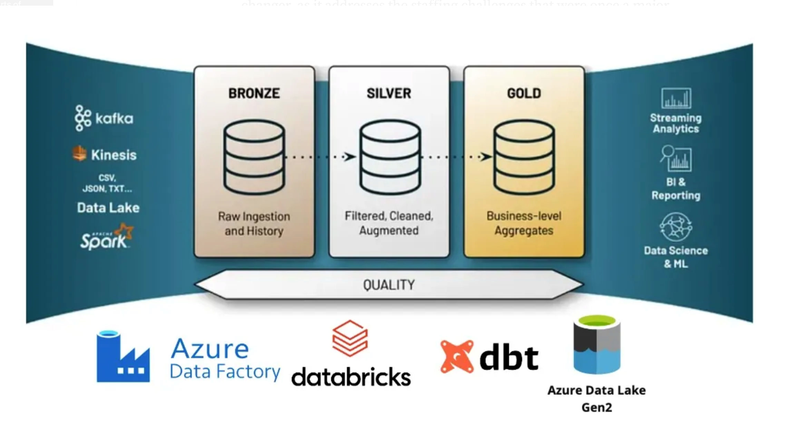

# End-to-End Data Engineering Project on Azure

This project demonstrates an end-to-end data engineering pipeline using **Microsoft Azure** and **dbt (Data Build Tool)** for scalable data transformation and orchestration.

## 🚀 Overview



This pipeline covers the entire data lifecycle — from **ingestion** and **storage** to **transformation** and **analytics** — built on a modern Azure ecosystem.

---

## 🧰 Tools and Technologies

| Tool | Description | Official Link |
|------|--------------|----------------|
| ☁️ **Azure** | Cloud platform providing secure, scalable infrastructure for data services. | [Azure Overview](https://azure.microsoft.com/en-us/get-started/) |
| 🗄️ **Azure SQL Database** | Managed relational database for structured data and querying. | [Azure SQL Database](https://learn.microsoft.com/en-us/azure/azure-sql/database/sql-database-overview) |
| 📂 **Azure Data Lake Storage** | Centralized data lake for raw, intermediate, and processed data. | [Azure Data Lake Storage](https://learn.microsoft.com/en-us/azure/storage/blobs/data-lake-storage-introduction) |
| 🔐 **Azure Key Vault** | Securely stores keys, secrets, and credentials. | [Azure Key Vault](https://learn.microsoft.com/en-us/azure/key-vault/general/overview) |
| ⚙️ **Azure Databricks** | Apache Spark-based analytics platform for scalable data processing. | [Azure Databricks](https://learn.microsoft.com/en-us/azure/databricks/) |
| 🔄 **Azure Data Factory** | Orchestrates and automates data movement and transformations. | [Azure Data Factory](https://learn.microsoft.com/en-us/azure/data-factory/introduction) |
| 🧱 **dbt (Data Build Tool)** | SQL-based tool for transformations, testing, and documentation. | [dbt Docs](https://docs.getdbt.com/) |

---

## 📚 Sample Dataset

Uses the **AdventureWorks LT** sample database — a retail dataset for demonstrating ETL and analytics workflows.

---

## 🏁 Getting Started

### 🔧 Commands
Run the following dbt commands after configuration:

```bash
dbt run            # Execute data models
dbt test           # Run data quality tests
dbt snapshot       # Handle slowly changing dimensions
dbt docs generate  # Generate documentation
dbt docs serve     # Preview docs in browser
